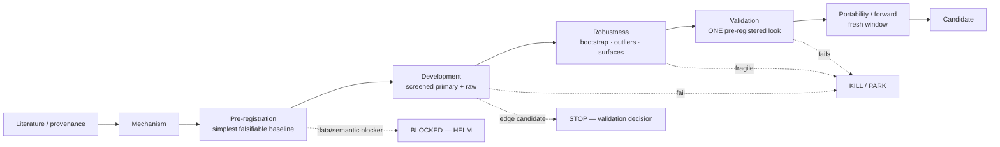
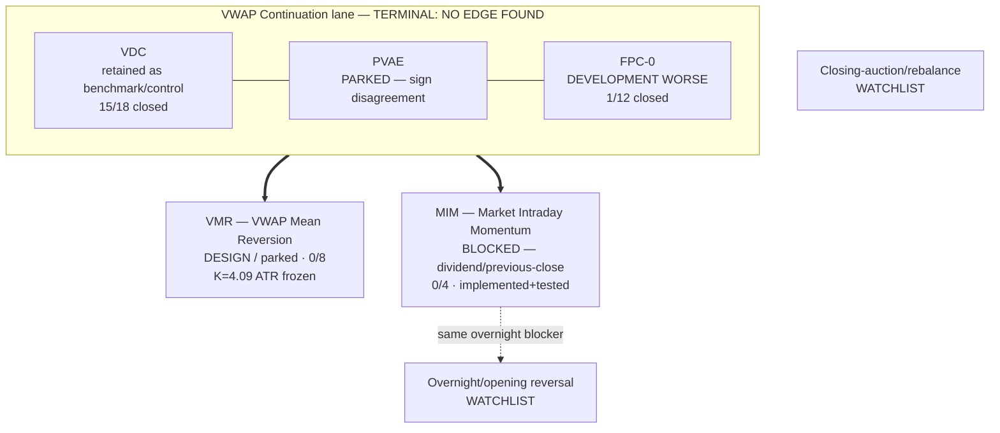

# RESEARCH MAP · v1.0 · 2026-08-27

A visual map of the research pipeline and the current family statuses. Rendered by
GitHub via Mermaid. Canonical detail lives in
[`STRATEGY_RESEARCH_LEDGER.md`](STRATEGY_RESEARCH_LEDGER.md) and the frozen manifests.

## The pipeline

Every family walks the same path; most die early, which is the point — cheap,
pre-registered falsification before any confirmation data is spent.

Gates (frozen before outcomes): development uses the primary metric + a materiality
threshold; validation is a **single** pre-registered look; a consumed validation
window is never reused. STOP conditions and autonomy are in
[`FAMILY_AUTONOMY_PROTOCOL_v1.0.md`](FAMILY_AUTONOMY_PROTOCOL_v1.0.md); metrics in
[`METRIC_PRIMER.md`](METRIC_PRIMER.md).

## Current family statuses

Legend: **TERMINAL** = concluded no edge; **DESIGN** = chartered, not run; **BLOCKED**
= data/semantic stop awaiting HELM; **WATCHLIST** = not yet opened.

## Where we are (2026-08-27)

- The **continuation lane is closed** (VDC/PVAE/FPC) — NO EDGE FOUND; VDC kept as a
  benchmark only.
- **VMR** is designed and parked (owner request) with a trade-blind frozen threshold.
- **MIM** is the active family, but its exact previous-close-crossing return hits a
  **dividend/corporate-action data blocker** on the split-only corpus → STOP (C),
  pending an ex-dividend calendar or a dividend-adjusted close series.
- Two watchlist families remain unopened; the overnight-reversal one inherits MIM's
  blocker, and the closing-auction one needs auction/imbalance data OHLCV cannot supply.
